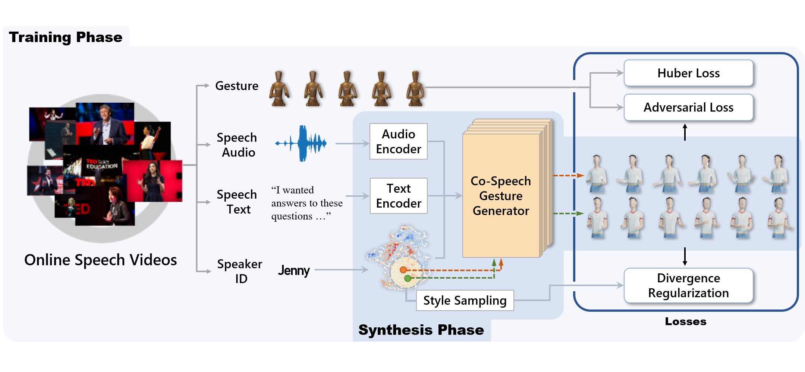
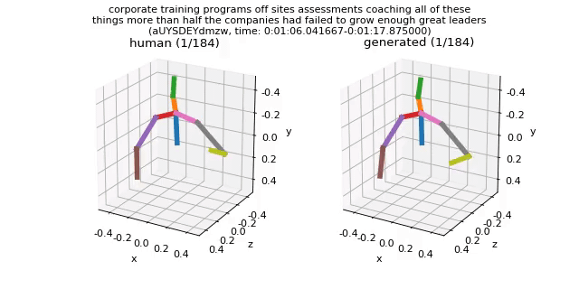
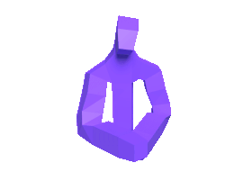

# Gesture Generation from Trimodal Context

This is an official pytorch implementation of *Speech Gesture Generation from the Trimodal Context of Text, Audio, and Speaker Identity (SIGGRAPH Asia 2020)*. In this paper, we present an automatic gesture generation model that uses the multimodal context of speech text, audio, and speaker identity to reliably generate gestures. By incorporating a multimodal context and an adversarial training scheme, the proposed model outputs gestures that are human-like and that match with speech content and rhythm. We also introduce a new quantitative evaluation metric, called FGD, for gesture generation models.

### [PAPER](https://arxiv.org/abs/2009.02119) | [VIDEO](https://youtu.be/2nDaBHUWpC0)



## Environment

This repository is developed and tested on Ubuntu 18.04, Python 3.6+, and PyTorch 1.3+. On Windows, we only tested the synthesis step and worked fine. On PyTorch 1.5+, some warning appears due to read-only entries in LMDB ([related issue](https://github.com/pytorch/pytorch/issues/37581)).

## Quick Start

### Installation

1. Clone this repository:
   ```
   git clone https://github.com/ai4r/Gesture-Generation-from-Trimodal-Context.git
   ```

0. Install required python packages:
   ```
   pip install -r requirements.txt
   ```

0. Install Gentle for audio-transcript alignment. Download the source code from [Gentle github](https://github.com/lowerquality/gentle) and install the library via `install.sh`. And then, you can import gentle library by specifying the path to the library at `script/synthesize.py` line 27.


### Preparation

1. Download [the trained models](https://kaistackr-my.sharepoint.com/:u:/g/personal/zeroyy_kaist_ac_kr/Ec1UIsDDLHtKia04_TTRbygBepXORv__kkq-C9IqZs32aA?e=bJGXQr) and extract to `./output` folder (it also includes the trained autoencoder model for FGD).

0. Download [the preprocessed TED dataset](https://kaistackr-my.sharepoint.com/:u:/g/personal/zeroyy_kaist_ac_kr/EYAPLf8Hvn9Oq9GMljHDTK4BRab7rl9hAOcnjkriqL8qSg) (16GB) and extract the ZIP file into `data/ted_dataset`. You can find out the details of the TED datset from [here](https://github.com/youngwoo-yoon/youtube-gesture-dataset), and please refer to the paper how we extended the existing TED dataset.

0. Download pretrianed fasttext model from [here](https://dl.fbaipublicfiles.com/fasttext/vectors-english/crawl-300d-2M-subword.zip) and put `crawl-300d-2M-subword.bin` and `crawl-300d-2M-subword.vec` at `data/fasttext`.

0. Setup [Google Cloud TTS](https://cloud.google.com/text-to-speech). You need to set the environment variable `GOOGLE_APPLICATION_CREDENTIALS`. Please see [the manual here](https://cloud.google.com/docs/authentication/getting-started). You can skip this step if you're not going to synthesize gesture from custom text.


### Synthesize from TED speech

Generate gestures from a clip in the TED testset: 

```
python scripts/synthesize.py from_db_clip [trained model path] [number of samples to generate]
```

You would run like this:

```
python scripts/synthesize.py from_db_clip output/train_multimodal_context/multimodal_context_checkpoint_best.bin 10
```

The first run takes several minutes to cache the datset. After that, it runs quickly.   
You can find synthesized results in `output/generation_results`. There are MP4, WAV, and PKL files for visualized output, audio, and pickled raw results, respectively. Speaker IDs are randomly selected for each generation. The following shows a sample MP4 file.




### Synthesize from custom text

Generate gestures from speech text. Speech audio is synthesized by Google Cloud TTS.

```
python scripts/synthesize.py from_text [trained model path] {en-male, en-female}
```

You could select a sample text or input a new text. Input text can be a plain text or [SSML markup text](https://cloud.google.com/text-to-speech/docs/ssml). The third argument in the above command is for selecting TTS voice. You might further tweak TTS in `./scripts/utils/tts_help.py`.
 

## Training

Train the proposed model:
```
python scripts/train.py --config=config/multimodal_context.yml
```

And the baseline models as well:

```
python scripts/train.py --config=config/seq2seq.yml
python scripts/train.py --config=config/speech2gesture.yml
python scripts/train.py --config=config/joint_embed.yml 
```

Caching TED training set (`lmdb_train`) takes tens of minutes at your first run. Model checkpoints and sample results will be saved in subdirectories of `./output` folder. Training the proposed model took about 8 h with a RTX 2080 Ti.

Note on reproducibility:  
unfortunately, we didn't fix a random seed, so you are not able to reproduce the same FGD in the paper. But, several runs with different random seeds mostly fell in a similar FGD range.

### Fréchet Gesture Distance (FGD)

You can train the autoencoder used for FGD. However, please note that FGD will change as you train the autoencoder anew. We recommend you to stick to the checkpoint that we shared.
 
If you want to train the autoencoder anew, prepare the Human3.6M dataset first. For your convenience, we share the dataset file [data_3d_h36m.npz](https://kaistackr-my.sharepoint.com/:u:/g/personal/zeroyy_kaist_ac_kr/EYT3xin3bzlCmar59FaLN8UBbDbK_mPn_8UL6in4W2RP6w?e=Lk9sU8) which was created by following https://github.com/facebookresearch/VideoPose3D/blob/master/DATASETS.md. Put the npz file to `./data/h36m/` folder, then run the training script.
   
```
python scripts/train_feature_extractor.py --config=config/gesture_autoencoder.yml
```
   

## Blender Animation

You can render a character animation from a set of generated PKL and WAV files.

Required:
* Blender 2.79B (not compatible with Blender 2.8+)
* FFMPEG 

First, set configurations in `renderAnim.py` script in `./blender/poseRender.blend`, and run the script at Blender 2.79B. Then, you will find out rendered frames and a MOV video in the specified output folder.   



Note that we refined rotations for some joints due to the articulation differences between the rigged skeleton and synthesized skeleton by the gesture generation model.

Character assets used in the paper: [Mannequin](https://blendermarket.com/products/rigged-mannequin-set), [Human](https://blendermarket.com/products/spring-people)


## Known Issues

* The models use `nn.LeakyReLU(True)` (LeakyReLU with the negative slope of 1). This was our mistake and our intention was `nn.LeakyReLU(inplace=True)`. We did not fix this for reproducibility, but please be aware of this.


## License

Please see `LICENSE.md`


## Citation

If you find our work useful in your research, please consider citing:

```
@article{Yoon2020Speech,
  title={Speech Gesture Generation from the Trimodal Context of Text, Audio, and Speaker Identity},
  author={Youngwoo Yoon and Bok Cha and Joo-Haeng Lee and Minsu Jang and Jaeyeon Lee and Jaehong Kim and Geehyuk Lee},
  journal={ACM Transactions on Graphics},
  year={2020},
  volume={39},
  number={6},
}
```

Please feel free to contact us (youngwoo@etri.re.kr) with any question or concerns.
